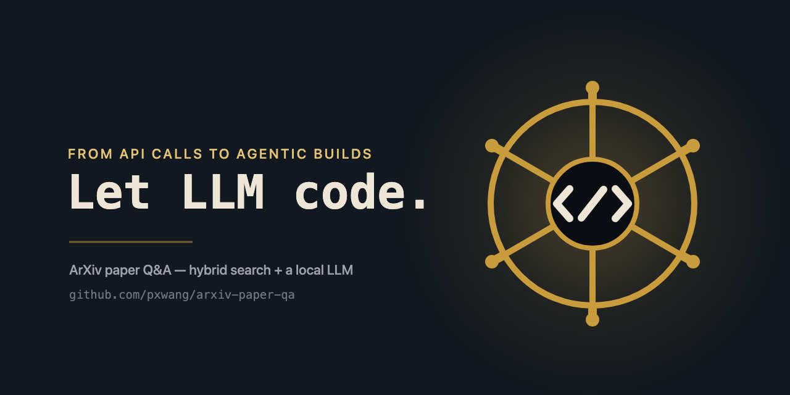
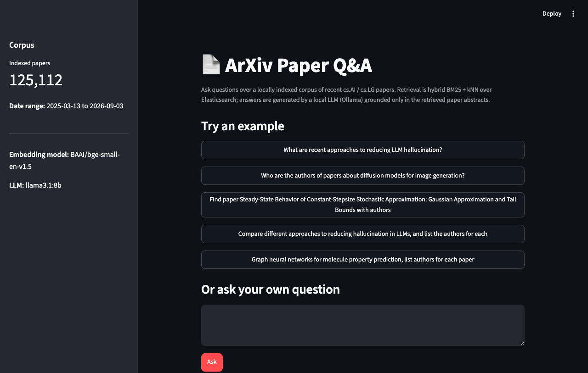

# ArXiv Scientific Paper Summarizer and Q&A

[](https://github.com/pxwang/arxiv-paper-qa/actions/workflows/test.yml)

Download recent ArXiv papers in a chosen field, index them in Elasticsearch
with dense-vector embeddings, and chat with the collection — find related
work, compare methodologies, or summarize findings across papers.

## Scope (v1)

- **Category:** `cs.AI` and `cs.LG` (AI / Machine Learning)
- **Time window:** last 1-2 years
- **Data source:** ArXiv's public API (`export.arxiv.org`) — always current,
  no Kaggle account needed. (The Kaggle/S3 snapshot dataset is a fine
  alternative later if you want the full historical corpus.)

## Architecture

```text
ArXiv API (export.arxiv.org)
    │  metadata + abstracts, filtered by category + date
    ▼
Ingestion (src/ingest.py)
    │  embed abstracts with BAAI/bge-small-en-v1.5 (local, CPU)
    ▼
Elasticsearch (dense_vector field + text fields)
    │  hybrid search: BM25 + kNN, fused with RRF
    ▼
Cross-encoder re-ranking (BAAI/bge-reranker-base, local, CPU)
    ▼
RAG chain (src/rag.py, LangChain)
    │  retrieve top-k chunks → prompt → local LLM
    ▼
Ollama (local LLM, Metal-accelerated on Apple Silicon)
    │
    ▼
Answer, with source paper citations
```

## Prerequisites

1. **Docker** (for Elasticsearch) — already installed.
2. **Ollama** (for the local LLM):
   ```bash
   brew install ollama
   ollama pull llama3.1:8b
   ```
3. **Python 3.11+** in a virtualenv:
   ```bash
   python3 -m venv .venv
   source .venv/bin/activate
   pip install -r requirements.txt
   ```
   > If you're on a very new Python (3.13+) and `torch`/`sentence-transformers`
   > fail to install, use `pyenv` to install Python 3.11 or 3.12 and recreate
   > the venv with that instead — ML package wheels lag behind new Python
   > releases.

   Direct dependencies in `requirements.txt` are pinned to exact versions
   (resolved against Python 3.11, matching CI) for reproducible installs.
   Transitive dependencies are left unpinned - torch pulls in Linux-only
   CUDA packages on Linux that have no macOS wheels, so a full transitive
   lock would break installs on macOS.

## Setup

```bash
# 1. Start Elasticsearch
docker compose up -d

# 2. Copy env template and adjust if needed
cp .env.example .env

# 3. Ingest papers (cs.AI + cs.LG, last ~18 months)
python -m src.ingest

# 4. Ask questions
python -m src.rag "What are recent approaches to reducing LLM hallucination?"

# ...or launch the web UI instead
streamlit run app.py
```

## Web UI

`app.py` is a small Streamlit front end over the same `ask()` pipeline used by
the CLI: a sidebar showing corpus stats (paper count, date range, embedding
model, LLM in use), a handful of example questions to try, and a free-text
box for your own. Run it with:

```bash
streamlit run app.py
```

Then open `http://localhost:8501`. Elasticsearch and Ollama both need to be
running first, same as the CLI.



### Caching

Fetched papers are cached to `data/papers.jsonl`. Re-running `python -m
src.ingest` reuses that cache instead of re-hitting the ArXiv API — handy
when re-indexing after changing the embedding model or index mapping, since
a full ~18-month fetch can take over an hour due to ArXiv's API rate limit.
Pass `--refresh` to force a fresh fetch:

```bash
python -m src.ingest --refresh
```

## Tests

```bash
pip install -r requirements-dev.txt
pytest
```

Tests mock Elasticsearch, the embedding model, the reranker, and the LLM (no
live services needed) - `ask()` accepts optional `es`/`embed_model`/
`reranker`/`llm` arguments for exactly this reason. Covers the BM25+kNN
Reciprocal Rank Fusion and cross-encoder re-ranking logic, the ArXiv-ID
direct-lookup path, `src/ingest.py`'s chunk caching/retry/resume behavior,
and a couple of past regressions (empty-index crash, vector source field).

## Lint

```bash
pip install -r requirements-dev.txt
ruff check .
```

Config in `pyproject.toml`. `src/ingest.py` and `src/rag.py` are exempted
from import-sort ordering (`I001`) since both deliberately import
`src.config` before third-party libraries, so `HF_HUB_OFFLINE` is set
before `huggingface_hub` reads it at import time - isort's default
stdlib/third-party/first-party ordering would silently undo that fix.

## Project layout

```text
src/
  config.py   - settings: ES connection, index name, category, date window, model names
  ingest.py   - fetch from ArXiv API, embed abstracts, index into Elasticsearch
  rag.py      - retrieve + generate: hybrid search in ES, then answer via Ollama
app.py              - Streamlit web UI over the rag.py pipeline
tests/              - pytest suite (mocked ES/embedding model/LLM)
docker-compose.yml  - single-node Elasticsearch for local dev
requirements.txt
requirements-dev.txt - adds pytest and ruff
pyproject.toml      - ruff lint config
.env.example
```

## Notes on scale

Scoped to `cs.AI`/`cs.LG` rather than the full ~2.7M-paper ArXiv corpus.
Observed throughput is ~270 papers/day across both categories combined, so
18 months is roughly 150,000 papers. At 384-dim embeddings
(`bge-small-en-v1.5`), that's small in practice:

| Component | Estimate |
|---|---|
| Raw vectors (384 dims × 4 bytes × 150k docs) | ~230 MB |
| HNSW graph overhead (default `m=16`) | ~20 MB |
| Text (title/abstract, indexed + stored) | ~600 MB - 1 GB |
| **Total Elasticsearch data size** | **~1-1.5 GB** |

Comfortably within the 2GB JVM heap in `docker-compose.yml`, with room to
spare on a 16GB machine even with Ollama's model loaded. The actual
bottleneck for a full 18-month ingest is ArXiv's API rate limit (~75
minutes), not memory — see the Caching section above for avoiding repeat
fetches.

## Status

Early scaffold — ingestion, RAG pipeline, and a Streamlit web UI are
functional for the MVP scope above. Next step: chunking for full-text
(currently abstract-only).
